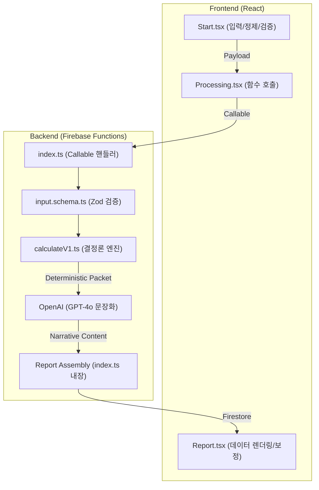

# ATOMIC-R2-00_ARCH_MAP
**일자**: 2026-01-05
**감사관**: 시스템 아키텍트 / 수석 감사관
**상태**: **AS-IS 분석 완료**

## 1. 기준선 검증 (Baseline Verification)
- **Git Branch**: `feat/phase23-name-persona-placeholder-kill`
- **HEAD Commit**: `ea9b8a34bf0bbb93634c3bc38462f072df62c467`
- **Node**: `v22.19.0`, **NPM**: `11.7.0`
- **R1 Gate**: `npm run verify` 통과 (로그: `docs/refactor/R2_BASELINE_VERIFY.log`)

## 2. AS-IS 아키텍처 경계권 지도 (Architecture Map)

## 3. 핵심 아키텍처 결함 (Mixing Points)

1.  **Contract 파편화 (Schema Mixing)**:
    - 현재 입력 스키마(`input.schema.ts`)가 백엔드 내부 디렉토리에만 존재하여 프론트엔드와 공유되지 않음.
    - 출력 스키마(Output Contract)가 명시적으로 정의되지 않아 렌더러(`Report.tsx`)가 `normalizeSection`을 통해 사후 보정을 수행함 (리스크: 데이터 불일치).

2.  **계산과 문장화의 논리적 결합**:
    - 리포트 조립(`Assembler`) 로직이 `index.ts` 핸들러 내에 강하게 결합되어 있어, 섹션 누락이나 구조 결함 시 유연한 대응이 어려움.

3.  **품질 게이트(Quality Gate) 부재**:
    - LLM이 생성한 결과물의 구조적 무결성(3단 구조 여부 등)을 검증하는 독립적인 게이트가 없어, 렌더링 시점에 placeholder가 노출될 위험이 있음.

## 4. 핵심 파일 인벤토리 (Inventory)

| 영역 | 기능 | 파일 경로 |
| :--- | :--- | :--- |
| **프론트** | 제출 및 1차 검증 | `src/pages/Start.tsx` |
| **백엔드** | 진입점 및 세션 관리 | `functions/src/index.ts` |
| **계약** | 입력 스키마 | `functions/src/contracts/input.schema.ts` |
| **엔진** | 결정론적 사주 계산 | `functions/src/engine/calculation/v1.ts` |
| **렌더** | 리포트 정규화/출력 | `src/pages/Report.tsx`, `src/types/report.ts` |

## 5. R2 리팩토링 목표 (To-Be)
- `contracts/` 폴더를 루트로 격상하여 FE/BE가 동일한 TS/Zod 스키마 공유.
- `reportAssembler.ts`를 독립시켜 LLM 응답 필터링 및 리페어 로직 집중.
- 계산 엔진 결과를 `DeterministicPacket` 타입으로 표준화하여 LLM이 절대 계산 결과(Pillars 등)를 조작할 수 없도록 격리.

---
**판정**: **AS-IS 분석 완료. R2-01 착수 가능.**
